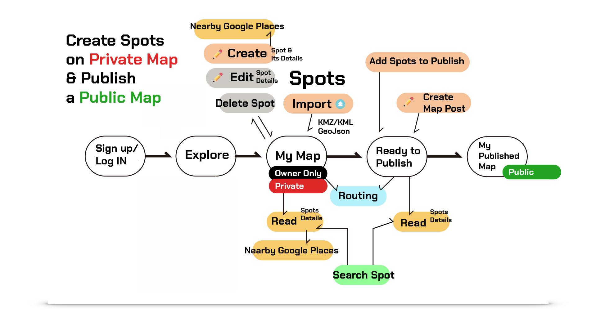
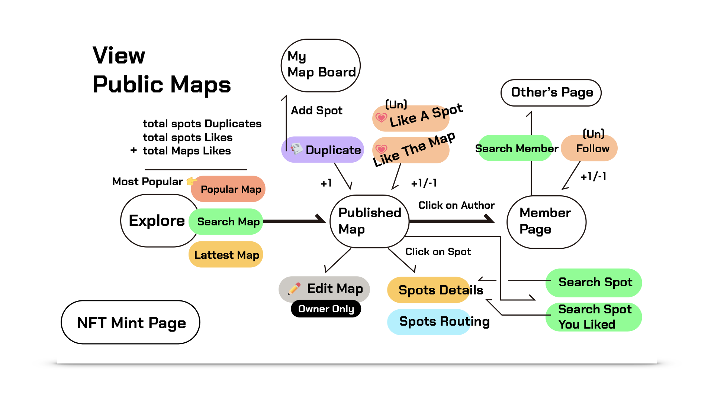

This is a [Next.js](https://nextjs.org/) project bootstrapped with [`create-next-app`](https://github.com/vercel/next.js/tree/canary/packages/create-next-app).

# About Hidden Gem Spot

This is a Next.js project utilizing Tailwind CSS and TypeScript, aimed at providing people with a platform to create and share content about their favorite attractions.


Users can compile their personal attractions and publish them to the public as a "Map Post," complete with attached content. Others can then like your map post, show appreciation for your attractions with a ❤️, and even duplicate any attraction to their own private map.

The project is deployed on **Vercel**, using **CloudFlare** for DNS services, available at
[https://hidden-gem.xyz]()

**Database**: Utilizes Firebase Firestore for NoSQL DB and Firebase Storage for static database operations.
**Authentication**: Employs Firebase Auth (Email, Google) and is integrated with Clerk for third-party authentication, supporting both traditional web applications and blockchain-based logins via MetaMask.

The application incorporates the Quill Markdown Editor and the native Leaflet & OpenStreetMap for mapping functionalities, among other third-party modules. To enhance the user experience, it includes features such as lazy loading and drag-and-drop (for images). Additionally, it has successfully passed several Jest tests.

What Else:

1. Mini-Game **Drag-and-Drop** Module: This module allows users to drag attraction pins into a "bowl," which serves as the designated drop area. Once dropped, these attractions are added to the Map Post being created.

2. **NFT Minting**: Utilizing Web3.js and Clerk, users can mint their own NFTs. A simple HashLip NFT Contract was deployed using Remix and linked to a self-designed image (.png) stored on the IPFS service, Pinata, and then to the Polygon Mainnet. Anyone with a MetaMask Wallet can interact with the contract via the UI or PolyScan to mint the NFT at Hidden Gem Spot 旅圓 (hidden-gem.xyz).

3. **Google API** Integration: Through fetch requests to the Google Places API, users can effortlessly discover attractions near their selected location.

4. **KML & GeoJSON Upload**: Users can upload their .KMZ/.KML files or GeoJSON data, which may be generated by Google Maps' "My Map" feature or the Takeout function for exporting favorite (❤️) attractions and comments. We then convert these files into attractions and save them into the database.


## React:

- **useContext:** Utilizes the React context API to manage and share global state within the application, simplifying state management without introducing additional libraries.

- **Redux / Zustand:** These state management libraries offer scalable solutions for handling application state. Redux Toolkit simplifies Redux application development, making it more efficient and easier to manage. Zustand provides a minimalist and flexible approach to state management, suitable for handling specific features like KMZ/KML and GeoJSON data integration.

## Next.js:

- **SSR (Server-Side Rendering):** Implemented for the Home Page and Member Page, SSR enhances performance and SEO by rendering pages on the server before sending them to the client.

- **SSG (Static Site Generation):** Used for the Landing Page, SSG generates static pages at build time, improving load times and reducing server requests.

## Firestore:

- **Indexing:** Efficiently manages database queries to ensure fast retrieval of data, crucial for real-time applications.

## Map:

- The `/map` component integrates Leaflet for map functionalities, allowing users to create, edit, and delete places associated with markers. It supports numerous plugins like mini-map, search console, and routing machine, enabling route creation between markers (places).

## Dashboard:

- Offers comprehensive tools for content creation and management. Users can add titles, contents, tags, choose categories, and upload images for any spot. Features include search & filter by tags or keywords, show/hide UI elements for a cleaner interface, and switch between "Spot" and "Post" modes for focused interaction.

## Redux Toolkit / Zustand:

- Simplifies state management across the application. Zustand is specifically used for directly managing KMZ/KML and GeoJSON data with the map component, while Redux Toolkit handles broader state management needs, such as maintaining public map data for editing.

## useContext:

- Facilitates login state management across the application. Integrates with Firebase Auth and Clerk for diverse authentication methods (Email, Google), leveraging useContext for efficient state handling.

## i18N:

- Implements internationalization using **i18n-Next**, allowing users to browse the project in either English or Mandarin (Taiwan), enhancing accessibility and user experience.

## OnBoarding Process (Private Personal Map)




## Browsing Map Posts (Public)




### Server Components

Since I used `Page Router` to support some older versions of Next.js projects and to facilitate the creation of new pages, it was inevitable that all pages were `React Client Components` by default. This resulted in poor efficiency and SEO. To address these issues, I have undertaken the following initiatives:

🌟 Changed the Landing Page to `SSG` (Static Site Generation) to optimize SEO.

🌟 Changed the `Explore` Page to `SSR` (Server Side Rendering) to enhance SEO. Additionally, this page retrieves map data from Firestore (NoSQL DB), making server-side rendering a suitable approach in such cases.

🌟 Changed the `Member` Page to `SSR`. Updating 'Member Data, followers, and following too often would burden the servers unnecessarily.

🌟 While it's necessary to add the line `'use Client'` in `App Router`, `Page Router` simplifies the construction of highly interactive pages in my applications by utilizing a variety of hooks.

⚠️ **Further Optimization:** For enhanced efficiency, RSC (React Server Components) could be considered to reduce JS bundle size and mitigate lags caused by request waterfalls. This became a pressing issue as the project expanded. Monitoring through `LightHouse` revealed that utilizing `RSC` could significantly improve efficiency.

### See the slides for a complete pitch here:

[Slide Here](https://www.slideshare.net/slideshows/hiddengem-attraction-recording-platform-slide/266594257)

<iframe src="https://www.slideshare.net/slideshow/embed_code/key/E6YY8rWoZaJAnr?hostedIn=slideshare&page=upload" width="476" height="400" frameborder="0" marginwidth="0" marginheight="0" scrolling="no"></iframe>

## Getting Started with Next

`npm install `  or use `yarn`  to install packages first.

Second, run the development server

```bash
npm run dev
# or
yarn dev
# or
pnpm dev
```

Open [http://localhost:3000](http://localhost:3000) with your browser to see the result.

You can start editing the pages by modifying everything under `src/pages `
 The page auto-updates as you edit the file since it's a Next App

# About Next.js

To learn more about Next.js, take a look at the following resources:

- [Next.js Documentation](https://nextjs.org/docs)  Next.js features and API.
- [Learn Next.js](https://nextjs.org/learn) Interactive Next.js tutorial.

Check out [the Next.js GitHub repository](https://github.com/vercel/next.js/) - your feedback and contributions are welcome!

## Deploy on Vercel

Using [Vercel Platform](https://vercel.com/new?utm_medium=default-template&filter=next.js&utm_source=create-next-app&utm_campaign=create-next-app-readme).

Reference:  [Next.js deployment documentation](https://nextjs.org/docs/deployment)
